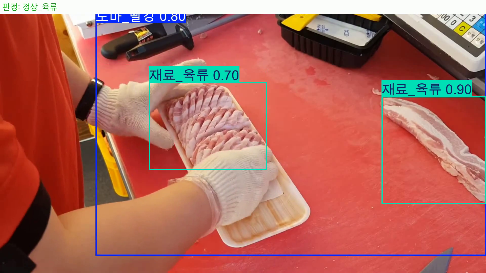
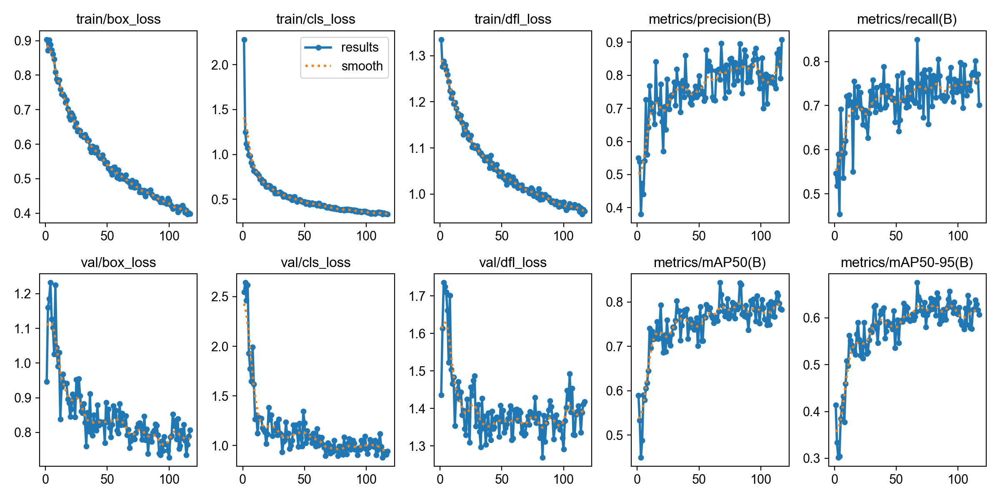
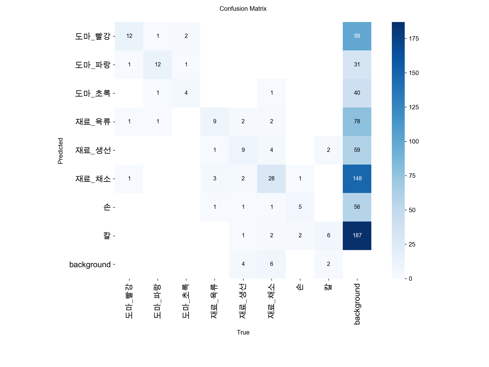
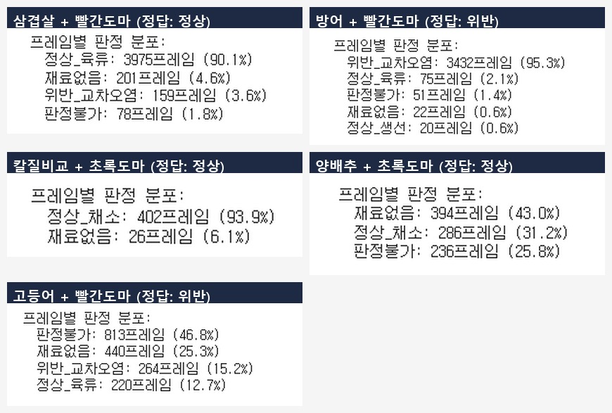
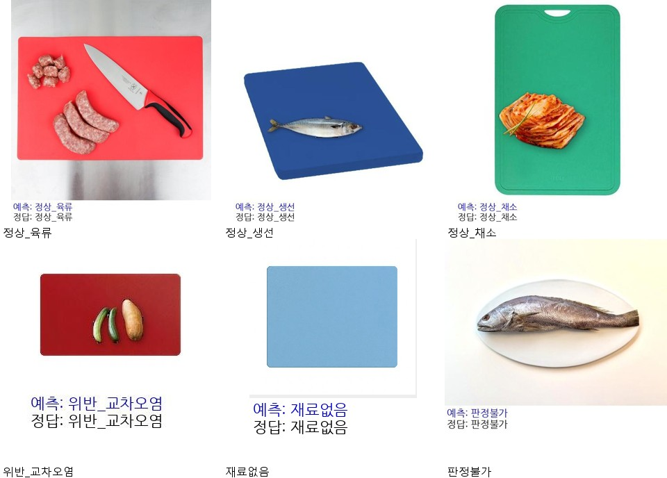
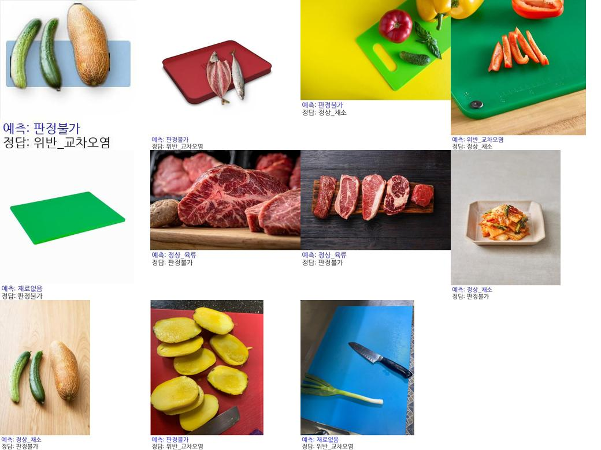

# 딥러닝 기반 도마–식재료 교차오염 판별 시스템 (YOLO11)

소규모 식당·카페 주방의 **교차오염(색상별 도마 규칙 위반)** 을 실시간 카메라 영상에서 자동으로 감지하는 위생 감시 시스템입니다.
관리자가 상주하지 않아도 카메라 한 대로, 도마 색상(육류=빨강·생선=파랑·채소=초록)과 그 위 식재료의 불일치를 상시 감시하고 위반을 표시합니다.

> 개인 프로젝트 · 2주 · 2026.07 (K-디지털 트레이닝 「AI 기반 지능형 솔루션 개발」 과정 수행)



**▶ 시연 영상 (삼겹살 실시간 판정):** [Google Drive](https://drive.google.com/file/d/1e8GSOQXXANHBPGULmp_ZtFP7dOqMOtw1/view?usp=drive_link)

---

## 문제 정의
- 도마 위 교차오염(생고기·생선·채소 혼용)은 식중독 사고의 대표 원인 중 하나입니다.
- 색상별 도마 구분은 HACCP 관행이지만, 바쁜 시간대엔 규칙이 흐트러지기 쉽습니다.
- 위생 규칙은 관리자가 매번 지켜보지 않는 한 지켜지기 어렵습니다 → **카메라 기반 상시 감시**로 해결.

## 핵심 설계 — 탐지와 판정의 분리
초기에는 "정상/위반"을 하나의 CNN으로 통짜 분류하려 했으나, **YOLO 객체탐지(위치만 탐지) + 규칙 기반 후처리(판정)** 로 분리했습니다.

```
[영상 프레임] → YOLO11s 객체탐지(8클래스 위치) → 후처리 규칙(도마색 × 재료 매칭) → 판정
                                                     → 최근 N프레임 다수결 스무딩(판정안정화)
```

- 색상이 판별의 핵심 신호라 **흑백 변환 없이 원본 컬러**로 학습했습니다.
- 판정 로직을 모델이 아니라 **규칙 코드**가 담당하도록 분리해, 데이터 효율과 일반화가 크게 좋아졌습니다.
- 실시간 영상의 프레임 흔들림·블러로 인한 순간 오검출은 **최근 N프레임 다수결/이동평균(판정안정화)** 으로 보완했습니다.

### 탐지 클래스(8개)와 판정 규칙
| 탐지 클래스 | 판정 | 조건 |
|---|---|---|
| 도마_빨강 / 도마_파랑 / 도마_초록 | 정상_육류 | 빨강 도마 + 육류 |
| 재료_육류 / 재료_생선 / 재료_채소 | 정상_생선 | 파랑 도마 + 생선 |
| 손 / 칼 | 정상_채소 | 초록 도마 + 채소 |
| | 위반_교차오염 | 위 조합에 맞지 않는 재료 감지 |

> 그 외 도마만 탐지되면 `재료없음`, 도마 자체를 못 찾으면 `판정불가`.

## 데이터셋
- **크롤링**: DDGS(DuckDuckGo) 자동 수집 + pHash 중복/색상비율 필터로 노이즈 제거
- **직접 보강**: 대파·오이·김치 등 부족한 유형을 검색·촬영으로 보강
- **합성 생성**: `rembg`(u2net)로 배경 제거한 재료를 도마 사진에 알파합성 — 위반 117장 + 정상 30장
- 최종 라벨링 **342장**(X-AnyLabeling) → 도마 조명 조건(밝기·색조·물기반사) 증강 포함 **750장**으로 학습 (train:val = 85:15)

## 학습 결과 (YOLO11s)
- 설정: `imgsz=640`, `epochs=300`(patience=50 조기종료), 117에폭 종료 — **최적 67에폭 가중치 채택**
- 성능(val 51장): **mAP50 0.844 · mAP50-95 0.675**

| 학습 곡선 | 혼동 행렬 |
|---|---|
|  |  |

## 실시간 영상 검증
유튜브 조리 영상 5종을 프레임 단위로 검증했습니다. **판정안정화(다수결 스무딩)** 적용 후 정확도가 개선됐습니다.

| 영상 (재료 + 도마) | 정답 | 결과(스무딩 후) |
|---|---|---|
| 삼겹살 + 빨간도마 | 정상 | 정상_육류 **93.8%** ✅ (스무딩 전 90.1%) |
| 방어 + 빨간도마 | 위반 | 위반_교차오염 **96.8%** ✅ |
| 칼질비교(채소) + 초록도마 | 정상 | 정상_채소 ✅ |
| 양배추 + 초록도마 | 정상 | 정상_채소(오답 없음) ✅ |
| 고등어 + 빨간도마 | 위반 | 흰살생선–육류 색상 유사로 일부 오분류 ⚠️ |



### 예측 예시
| 맞은 예시 | 틀린 예시(원인별) |
|---|---|
|  |  |

## 기술 스택
`Python` · `Ultralytics YOLO11s` · `OpenCV` · `rembg(u2net)` · `X-AnyLabeling` · `DDGS` · `pHash` · `ONNX`(온디바이스 export 준비)

## 저장소 구조
```
├── notebooks/  yolomaskdetection_YOLO11_변환.ipynb   # 학습·추론·영상검증
├── src/
│   ├── composite_violation.py       # 위반 조합 합성 데이터 생성기
│   └── resolve_occlusion_labels.py  # 가림(occlusion) 라벨 후처리
├── docs/       review_checklist.md, 영상출처_정리.txt
└── assets/     학습 곡선·혼동행렬·검증 그리드·데모 프레임
```
> 대용량 파일(원본 영상·이미지 데이터셋·모델 가중치)은 저장소에서 제외했습니다.

## 한계 · 배운 점 · 향후
- **평가 지표 선택**: R²(결정계수)는 회귀 지표라 객체탐지에는 성립하지 않음을 확인, **mAP**를 종합 지표로 사용. 과대적합은 정확도 하나가 아니라 train/val 손실 곡선의 격차로 판단.
- **한계**: 흰살생선–육류의 색상 유사로 인한 반복적 오분류. 도마_초록·칼 데이터가 상대적으로 부족.
- **영상에서 배운 점**: 정지 이미지보다 실시간 영상에서 순간 오검출이 많아, 프레임 단위가 아닌 **시간축 스무딩**이 필요.
- **향후**: 위반 이벤트 최소 지속시간 필터·이동평균 스무딩 고도화, 다양한 각도·조명 데이터 보강, ONNX 온디바이스 배포.

## 영상 출처
검증에 사용한 유튜브 영상 출처는 [`docs/영상출처_정리.txt`](docs/영상출처_정리.txt)에 정리했습니다.
